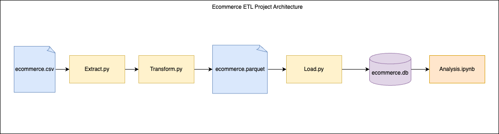

# Copilot Workshop - Data Engineering Starter Code

Welcome to the Copilot Data Engineering Workshop! This repository provides you with a starter codebase to experiment with various data engineering tasks using Python. 

## Prerequisites

Before you begin, make sure you have the following prerequisites installed on your system:

- Python 3 (Python 3.6 or higher is recommended)
- `pip` (Python package manager)
- Java ( PySpark requires Java 8 or later with JAVA_HOME properly set. )


## Problem Statement

<b>The dataset used for this workshop is publically available [E-commerce Dataset](https://www.kaggle.com/datasets/mervemenekse/ecommerce-dataset) of an American company.</b>

In the context of an E-commerce business operating in America, they have collected a year's worth of transactional data from their customers. They aim to gain deep insights into their customers' online buying habits and identify opportunities for improving their services and revenue. To achieve this, they require your help to perform data transformation and analysis as part of their existing E-commerce ETL pipeline and dataset.




## Dataset columns and meaning

- `Order_Date`: The date the product was ordered.
- `Aging`: The time from the day the product is ordered to the day it is delivered.
- `Customer_id`: Unique ID created for each customer.
- `Gender`: Gender of the customer.
- `Device_Type`: The device the customer uses to complete the transaction (Web/Mobile).
- `Customer_Login_Type`: The type of customer login, such as Member, Guest, etc.
- `Product_Category`: Product category.
- `Product`: Product description.
- `Sales`: Total sales amount.
- `Quantity`: Unit amount of the product.
- `Discount`: Percent discount rate.
- `Profit`: Profit generated.
- `Shipping_cost`: Shipping cost.
- `Order_Priority`: Order priority, such as critical, high, etc.
- `Payment_method`: Payment method.


## Getting Started

Follow these steps to set up your environment and run the provided data engineering script:

1. Clone this repository to your local machine:

   ```bash
   git clone https://github.com/thoughtworks-hands-on/ecom-etl-data
   ```

2. Navigate to the project directory:

   ```bash
   cd ecom-etl-data
   ```

3. Create a virtual environment to isolate project dependencies:

   ```bash
   python3 -m venv env
   ```

4. Activate the virtual environment:

   ```bash
   source env/bin/activate
   ```

5. Install the required Python packages from the `requirements.txt` file:

   ```bash
   pip install -r requirements.txt
   ```

   
## Running the ETL Script

Now that you have set up your environment, you can run the ETL (Extract, Transform, Load) script to experiment with data engineering tasks.

To run the ETL script, execute the following command:

```bash
python3 etl.py
```


## Working with `transform.py`

The `transform.py` file is a key component of your data engineering pipeline. It's where you can apply various transformations to your data to prepare it for analysis. Here are some steps to get started with `transform.py`:

1. Open the `transform.py` file from `src/jobs` folder in your code editor.

2. Review the existing code and understand the data transformations that are already implemented.

3. Modify the `transform.py` script as needed for your specific use case. You can add, remove, or customize data transformation functions to suit your data engineering requirements.

4. Optionally, you can consider using [Test-Driven Development (TDD)](https://antoprince001.medium.com/test-driven-development-in-pyspark-3b48f77bca06) principles to ensure the correctness of your data transformations. Write unit tests for your transformation functions in a separate test_transform.py file under `tests/jobs` folder and run the tests regularly.

5. To execute the test suite using pytest, execute the following command
   ```bash
   pytest tests/jobs/test_transform.py
   
   ```

6. Make use of Copilot's code suggestions and autocompletion features to make your data transformation tasks more efficient and productive.


## Working with `analysis.ipynb`

The `analysis.ipynb` file is a Jupyter Notebook where you can perform in-depth data analysis and visualization on your transformed data. Here's how to work with `analysis.ipynb`:

1. Open the `analysis.ipynb` notebook using VS code or any other compatible Jupyter Notebook tool. Alternatively, run the following command in local terminal.
   ```bash
   jupyter notebook

   ```

3. Review the existing code to load the transformed data into the notebook.

4. Explore the data, perform statistical analysis, and create visualizations to gain insights from your data.

5. Feel free to experiment with copilot for different analysis techniques and visualizations to extract valuable information from your data.

6. Optionally, the tasks in analysis.ipynb can also be done by creating `analysis.py` file. Choose the option that best suits your workflow and preferences for data analysis.

Happy data engineering with Copilot! 🚀📊
